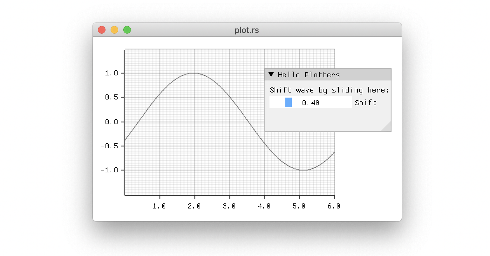

## plotters-imgui

An [imgui](https://github.com/Gekkio/imgui-rs) Rust backend for
[plotters](https://github.com/38/plotters). Usefuly if you want to

* animate your plotters charts and make them interactive, or
* add plotting functionality to your imgui application.



### Limitations

The backend currently does not support different font styles and sizes
since this doesn't have first class support in imgui. Therefore, chart
captions, axis labels etc will always be rendered in the default font
that you have configured for imgui.

### Usage

Just import `plotters_imgui::ImguiBackend` and use as a plotters backend:

```rust
let dl = ui.get_background_draw_list();
let root = ImguiBackend::new(&ui, &dl, (400, 300)).into_drawing_area();

let mut chart = ChartBuilder::on(&root)
    .margin(20)
    .x_label_area_size(30)
    .y_label_area_size(30)
    .build_cartesian_2d(0.0..6.0, -1.5..1.5).unwrap();

chart.configure_mesh().draw().unwrap();

chart
    .draw_series(LineSeries::new(
        (0..=600).map(|x| x as f64 / 100.0).map(|x| (x, x.sin())),
        &BLACK.mix(0.5),
    )).unwrap();

```

### Full Example

For a compiling, interactive example, see the [examples](./examples)
directory.
